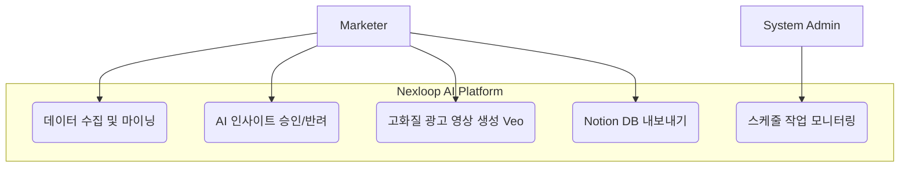
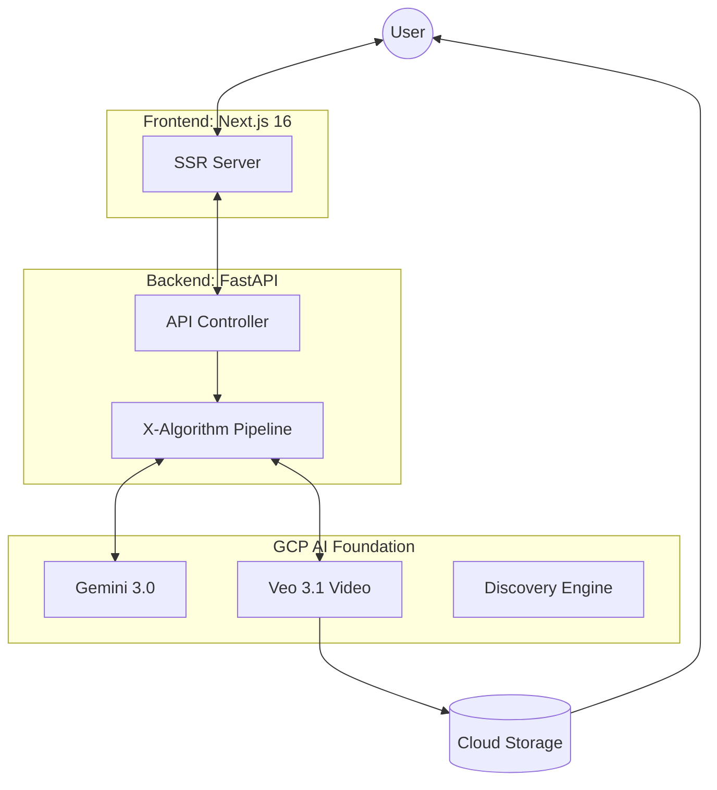
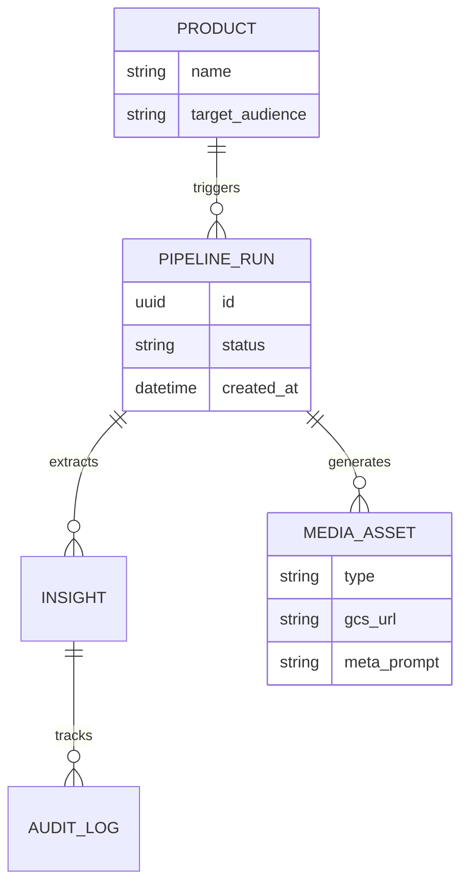

  
  
<strong>"기업의 고유한 브랜드 가치와 데이터를 비즈니스 자산으로 전환하는 엔터프라이즈 AI 지능 플랫폼"</strong>

  

    
    
    
    
  

  

    <a href="#-서비스-소개">서비스 소개</a> •
    <a href="#-시스템-설계">시스템 설계</a> •
    <a href="#-핵심-로직">핵심 로직</a> •
    <a href="#-화면-구성">화면 구성</a> •
    <a href="#-기술-스택">기술 스택</a> •
    <a href="#-팀원-역할">팀원 역할</a>
  

---

## 👀 서비스 소개 (Platform Overview)

- **서비스명**: Nexloop AI (넥스루프 AI)
- **핵심 가치**: **Vertex AI-Driven Context Intelligence & Creative Automation**
- **설명**:
  Nexloop AI는 **Google Cloud Vertex AI** 생태계를 기반으로 구축된 엔터프라이즈 지능 플랫폼입니다. 기업의 전용 브랜드 자산과 내부 데이터(RAG)를 Vertex AI의 강력한 모델군(Gemini, Veo) 및 검색 엔진과 결합하여, 기업 고유의 맥락에 최적화된 비즈니스 솔루션을 제공합니다.

## 📅 프로젝트 기간

**2024.01.20 ~ 진행 중 (Active Development)**

---

## ⚙️ 시스템 설계 (Architecture & Design)

### 📌 SW 유스케이스 (Use Case)

사용자가 시스템과 상호작용하며 인사이트를 결과물로 만드는 과정입니다.

### 🏢 데이터 영구 저장 구조 (Storage Hybrid)

Nexloop AI는 가용성과 감사(Audit)를 위해 하이브리드 저장 방식을 사용합니다.

- **Pipeline Results**: 분석 결과 및 미디어 메타데이터는 인메모리 캐시 및 `outputs/metadata/*.json` 파일에 저장됩니다. (Cloud Run 배포 시 GCS 동기화 지원)
- **Audit & Governance**: 모든 관리 활동 및 승인 이력은 **SQLAlchemy**를 통해 RDBMS(SQLite/Cloud SQL)의 `audit_logs` 테이블에 영구 기록됩니다.

### 📌 시스템 구성도 (System Architecture)

### 📌 데이터 관계도 (ER Diagram)

---

## ⭐ 플랫폼 핵심 역량 (Core Capabilities)

- **🧩 맞춤형 맥락 엔진 (X-Algorithm Context Engine)**: 단순 데이터 추출을 넘어 기업의 페르소나와 비즈니스 목표에 최적화된 인사이트 추출 파이프라인.
- **🎨 브랜드 정체성 컨트롤러 (Brand Compliance Control)**: Brand Kit 연동을 통해 AI가 생성하는 모든 영상, 이미지, 텍스트가 기업의 공식 가이드를 완벽히 준수하도록 보장.
- **🛡️ 엔터프라이즈 거버넌스 (Governance & Security)**: 모든 AI 작업에 대한 전수 감사 로그(Audit Trail)와 권한 관리 시스템을 통해 기업 내 안전한 AI 도입 지원.
- **🔌 데이터 연결성 (Adaptive Connectivity)**: **Vertex AI Search (Discovery Engine)** 기반 RAG를 통해 사내 문서와 외부 웹 데이터를 융합한 답변 제공 및 자산화.
- **☁️ Vertex AI 네이티브 연동**: Gemini(텍스트/이미지 분석)와 Veo(영상 생성)가 Vertex AI 플랫폼 상에서 통합 인증 및 보안 가이드라인 내에서 안전하게 운영.

---

## 🖥 화면 구성

### 1️⃣ 분석 대시보드

- 소셜 미디어 트렌드 분석 및 파이프라인 진행 상태 실시간 모니터링

### 2️⃣ 크리에이티브 스튜디오

- 생성된 인사이트를 바탕으로 **Veo 영상 프리뷰** 및 AI 썸네일 스타일 비교 제작

### 3️⃣ 시스템 어드민

- 팀/권한 관리 및 모든 AI 작업에 대한 **감사 로그(Audit Logs)** 확인

---

## ⛏ 기술 스택

<table>
    <tr>
        <th>구분</th>
        <th>내용</th>
    </tr>
    <tr>
        <td>기본 언어</td>
        <td>
             
            
        </td>
    </tr>
    <tr>
        <td>Frontend</td>
        <td>
            
            
            
        </td>
    </tr>
    <tr>
        <td>Backend</td>
        <td>
            
            
            
        </td>
    </tr>
    <tr>
        <td>AI Platform & Infra</td>
        <td>
            
            
            
            
        </td>
    </tr>
</table>

---

## 👨‍👩‍👧‍👦 팀원 역할

<table>
  <tr>
    <td align="center"></td>
  </tr>
  <tr>
    <td align="center"><strong>류훈민 (HUNMINRYU)</strong></td>
  </tr>
  <tr>
    <td align="center"><b>Lead Architect / AI Engineer</b>
       • 전계층 시스템 설계 및 인프라 구축
       • X-Algorithm 파이프라인 엔진 개발
       • Gemini/Veo 모델 연동 및 프롬프트 최적화
       • Next.js 16 기반 B2B 대시보드 구현
    </td>
  </tr>
</table>

---

## 🤾‍♂️ 트러블슈팅

### 1. 차세대 스택(Next 16 Canary) 도입에 따른 빌드 안정성

- **문제점**: 최신 React 19 Compiler와 Next.js 16의 실험적 기능 사용 시 Cloud Build 서버에서 정적 리소스 생성 오류 발생.
- **해결방안**: 모든 API 요청을 **클라이언트 브라우저 환경**에서만 실행되도록 `api.ts` 내 환경 체크 가드를 추가하고, **Zustand** 및 **useEffect** 기반의 비동기 폴링 로직으로 전환하여 해결.
- **Beyond the Fix**: 추후 Next.js 정식 버전 릴리즈 시 안정적인 배포 파이프라인으로 전환 계획.

### 2. 멀티모달 데이터 스트리밍 성능 최적화

- **문제점**: Veo 영상 및 고해상도 썸네일 생성 시 GCS 업로드 및 서버 응답 지연 발생.
- **해결방안**: 비동기 Celery 아키텍처 대신 FastAPI `BackgroundTasks`와 GCS Signed URL 방식을 결합하여 응답 가용성 확보.
- **Beyond the Fix**: 글로벌 서비스를 위해 CDN(Cloud CDN) 캐싱 레이어 도입 검토 중.

### 3. 빌드 타임 API 호출 차단 (Build-time Fetch Blocking) 🩺 [`frontend/src/lib/api.ts`](./frontend/src/lib/api.ts)

- **문제점**: `next build` 시 서버 컴포넌트 프리렌더링 과정에서 실제 백엔드 API 서버가 준비되지 않아 빌드가 실패하거나 무한 대기하는 현상.
- **해결방안**: `request` 함수 최상단에 `typeof window === 'undefined' && !API_BASE_URL` 가드로 실제 호출을 차단하고 빈 객체를 반환하도록 개선.
- **Beyond the Fix**: 런타임 환경 변수 주입(Injection) 방식을 완전히 분리하여 빌드 시 독립성 확보.

### 4. 엄격한 타입 안전성 확보 (`any` 제거) 🩺 [`frontend/src/types/`](./frontend/src/types/)

- **문제점**: 대규모 멀티모달 데이터(Veo, Gemini) 처리 시 `any` 타입 사용으로 인한 정적 분석 무력화 및 유지보수성 저하.
- **해결방안**: `TaskId`, `GcsPath` 등 도메인 특화 타입을 정의하고, API 응답 스키마를 `types/api.ts`에 전수 명시하여 린트 에러 'Zero' 달성.
- **Beyond the Fix**: 백엔드 Pydantic 모델과 프론트엔드 TypeScript 타입을 자동 동기화하는 OpenAPI Generator 도입 검토 중.

---

## 🗺️ 전략적 로드맵 (Strategic Roadmap)

### Phase 1: Intelligent Pipeline Foundation (Present)

- [x] **Core Logic**: X-Algorithm 기반 마켓 인사이트 추출 자동화
- [x] **Creative Automation**: Veo 3.1 & Gemini 3.0 연동 영상/썸네일 생성 인프라 구축
- [x] **Enterprise Admin**: 감사 로그 및 권한 관리 시스템 구현

### Phase 2: Enterprise Scaling & Deep Context (Q1-Q2)

- [ ] **Advanced RAG Integration**: 기업 내부 문서(PDF, Noton 등) 딥러닝 및 전용 챗봇 고도화
- [ ] **Brand Kit Evolution**: AI의 멀티모달 생성물에 대한 정교한 브랜드 톤앤매너 강제 로직 강화
- [ ] **Multi-Channel Pipeline**: 인스타그램, 틱톡 등 실시간 데이터 채널 전수 확장

### Phase 3: Connected Business AI (Future Vision)

- [ ] **External API Eco-system**: 기업용 CRM(Salesforce), ERP 연동을 통한 실시간 지표 분석
- [ ] **Custom Model Fine-tuning**: 기업 고유 데이터를 활용한 미디어 생성 모델 최적화 (LoRA 등)
- [ ] **Self-Learning Loop**: 사용자 피드백을 기반으로 파이프라인 로직이 자동 진화하는 지능형 루프 완성

---

  <strong>Built with Intelligence, Driven by Marketing Value - Nexloop AI</strong>

