<div align="center">
  
  <p><strong>AI 슬롭(AI Slop)을 차단하는 엔터프라이즈 AI 마케팅 플랫폼</strong></p>
  <p>
    
    
    
    
    
  </p>
</div>

---

## 1. 프로젝트명

**Nexloop AI** (팀명: HUNMINRYU)

---

## 2. 서비스 소개

생성형 AI 보급으로 맥락도 의미도 없는 저품질 콘텐츠(**AI Slop**)가 마케팅 생태계를 오염시키고 있습니다.

**Nexloop AI**는 Google Cloud Vertex AI(Gemini, Veo) 기반의 **AI 슬롭 저감 마케팅 플랫폼**입니다. X(Twitter) 추천 알고리즘에서 영감을 받은 **6단계 검증 파이프라인**으로 AI 슬롭을 차단하고, 브랜드에 정렬된 고품질 마케팅 콘텐츠만 생산합니다.

> **핵심 가치**: 데이터 수집 → AI 인사이트 추출 → 마케팅 전략 수립 → 크리에이티브 생성까지, 마케팅 콘텐츠 생산의 전 과정을 하나의 파이프라인으로 자동화합니다.

---

## 3. 프로젝트 기간

**2026.01.19 ~ 2026.02.13** 

---

## 4. 주요 기능

| 기능 | 설명 |
|------|------|
| 🔍 **데이터 수집·마이닝** | YouTube Data API + Naver 블로그/쇼핑 API로 실시간 데이터 수집 |
| 🧠 **X-Algorithm 파이프라인** | Two-Tower 임베딩으로 소싱 → 품질 필터링 → 19개 피처 추출 → AI 스코어링 → 다양성 보정 → Top-K 선정 |
| 🎨 **AI 크리에이티브 생성** | Gemini 썸네일 생성 + CTR 예측, Veo 3.1 마케팅 비디오, 마케팅 전략/SNS 카피 자동 생성 |
| 📊 **CTR 예측 모델** | Rule Tower(30%) + Embedding Tower(70%) 하이브리드 CTR 예측기 |
| 🤖 **AI 챗봇** | Gemini 기반 SSE 스트리밍 챗봇, Search Grounding 연동 |
| 🛡️ **거버넌스** | 감사 로그(Audit Log), 팀/권한(Role) 관리, 인사이트 승인/반려 워크플로우 |
| 💳 **구독 결제** | Stripe 연동 (체크아웃, 웹훅 서명 검증), FREE / PRO / BUSINESS 요금제 |
| ⏰ **자동 스케줄링** | Cloud Scheduler + OIDC 인증으로 파이프라인 정기 자동 실행 |
| 📤 **외부 연동** | Notion 자동 내보내기, GCS Signed URL 파일 다운로드 |

---

## 5. 기술 스택

| 구분 | 기술 |
|------|------|
| **Backend** | Python 3.11, FastAPI, SQLAlchemy 2, Pydantic v2, Alembic, Stripe SDK |
| **Frontend** | Next.js 16, React 19, TypeScript, Tailwind CSS v4, Zustand |
| **AI / ML** | Vertex AI (Gemini 2.5 Pro, Veo 3.1, text-embedding-004), Search Grounding, rank-bm25, NumPy |
| **GCP Infra** | Cloud Run, Cloud SQL (PostgreSQL), Cloud Build, Cloud Run Jobs, Cloud Storage, Cloud Scheduler, Secret Manager |
| **보안** | Session Cookie + CSRF (Double Submit), GCP OIDC, GCS V4 Signed URL, bcrypt |
| **품질** | pytest, pytest-asyncio, ruff, black, mypy (백엔드) · ESLint (프론트) |

---

## 6. 시스템 아키텍처

```
                      Google Cloud Platform (asia-northeast3)
  ┌──────────────────────────────────────────────────────────────────────┐
  │                                                                      │
  │   사용자 ──HTTPS──▶ Cloud Run: Frontend (Next.js 16 SSR)             │
  │                          │                                           │
  │                    API (Session Cookie + CSRF)                       │
  │                          ▼                                           │
  │                    Cloud Run: Backend (FastAPI)                       │
  │                     │          │           │                          │
  │              ┌──────┘     ┌────┘      ┌────┘                         │
  │              ▼            ▼           ▼                              │
  │        Cloud SQL     Vertex AI     Cloud Storage                     │
  │        (PostgreSQL)  (Gemini/Veo)  (썸네일/비디오)                    │
  │                                                                      │
  │   Cloud Scheduler ──OIDC──▶ Backend Webhook ──▶ 파이프라인 자동 실행  │
  │   Secret Manager: 9개 시크릿 → 환경변수 자동 주입                     │
  │   Cloud Build: Docker 빌드 → DB 마이그레이션(Job) → 서비스 배포       │
  │                                                                      │
  └──────────────────────────────────────────────────────────────────────┘
```

| 서비스 | 스펙 | 비고 |
|--------|------|------|
| **Backend** (Cloud Run) | 512Mi, 1CPU, min=1, max=100, cpu-boost | 콜드스타트 방지, timeout 300s |
| **Frontend** (Cloud Run) | 256Mi, 1CPU, max=10 | Multi-Stage Docker 빌드 |
| **DB 마이그레이션** | Cloud Run Job | 앱과 분리하여 경쟁 조건 방지 |
| **CI/CD** | Cloud Build | `cloudbuild.backend.yaml`, `cloudbuild.frontend.yaml` |

---

## 7. 유스케이스

### 마케터 (일반 사용자)

```
1. 로그인 → 제품 선택 → 파이프라인 실행
2. 파이프라인이 YouTube + Naver에서 데이터를 수집
3. AI가 6단계 검증 후 Top-K 인사이트 추출
4. 마케팅 전략 + 썸네일(CTR 예측) + 비디오 자동 생성
5. 결과 확인 → 승인/반려 → Notion 내보내기
```

### 관리자 (Admin)

```
1. 감사 로그(Audit Log)로 전체 작업 이력 추적
2. 스케줄 관리: 파이프라인 정기 자동 실행 설정
3. 팀/권한 관리: 사용자 역할(admin/approver/editor) 부여
4. CTR Ranker 승인 워크플로우: 후보 중 최적 크리에이티브 채택
```

### AI 챗봇 사용자

```
1. 웹사이트 방문 → 챗봇 대화
2. Gemini 기반 SSE 실시간 스트리밍 응답
3. Search Grounding으로 최신 정보 반영
4. FREE tier: 비로그인 IP별·로그인 사용자 일일 한도 적용
```

---

## 8. 서비스 흐름도

```
┌─────────────┐     ┌──────────────┐     ┌────────────────────────────────────────┐
│   사용자     │     │  프론트엔드   │     │              백엔드 (FastAPI)           │
│  (Browser)  │────▶│  (Next.js)   │────▶│                                        │
└─────────────┘     └──────────────┘     │  ① 인증 (Session Cookie + CSRF)        │
                                         │  ② 제품 선택 & 파이프라인 설정          │
                                         │  ③ 파이프라인 실행 (X-Algorithm)        │
                                         │     │                                   │
                                         │     ▼                                   │
                                         │  ┌────────────────────────────────────┐│
                                         │  │ Source → Filter → Hydration →      ││
                                         │  │ Scoring → Diversity → Selection    ││
                                         │  └────────────────────────────────────┘│
                                         │     │                                   │
                                         │     ▼                                   │
                                         │  ④ 콘텐츠 생성                          │
                                         │     ├── 마케팅 전략 (Gemini)            │
                                         │     ├── 썸네일 + CTR 예측 (Gemini)      │
                                         │     └── 비디오 (Veo 3.1)               │
                                         │     │                                   │
                                         │     ▼                                   │
                                         │  ⑤ 결과 저장                            │
                                         │     ├── Cloud SQL (메타데이터)           │
                                         │     ├── GCS (미디어 파일)               │
                                         │     └── Notion (자동 내보내기)           │
                                         │  ⑥ 승인 워크플로우                       │
                                         │     └── Admin/Approver → 채택/반려      │
                                         └────────────────────────────────────────┘
```

---

## 9. ER 다이어그램

```mermaid
erDiagram
    users ||--o{ user_sessions : "has"
    users ||--o{ user_daily_chat_usage : "has"
    users ||--o{ user_profiles : "has"
    users ||--o{ pipeline_schedules : "creates"
    users ||--o{ audit_logs : "performs"
    users ||--o{ ctr_ranker_approvals : "approves"
    users }o--|| roles : "belongs_to"
    users }o--o| teams : "member_of"

    users {
        int id PK
        string email UK
        string password_hash
        string name
        string role
        int role_id FK
        int team_id FK
        string subscription_tier
        string stripe_customer_id
        datetime created_at
        datetime updated_at
    }

    roles {
        int id PK
        string name UK
        string description
        datetime created_at
    }

    teams {
        int id PK
        string name UK
        datetime created_at
    }

    user_sessions {
        string id PK
        int user_id FK
        datetime created_at
        datetime expires_at
        datetime revoked_at
    }

    user_daily_chat_usage {
        int id PK
        int user_id FK
        date usage_date
        int count
    }

    pipeline_tasks {
        string task_id PK
        string product_name
        string status
        text result_json
        datetime created_at
        datetime updated_at
    }

    pipeline_schedules ||--|| users : "created_by"
    pipeline_schedules {
        int id PK
        string name
        int created_by FK
        string product_name
        string cron_expression
        boolean is_active
        datetime last_run_at
        datetime next_run_at
        datetime deleted_at
    }

    audit_logs {
        int id PK
        string action
        int user_id FK
        string entity_type
        string entity_id
        string meta_json
        datetime created_at
    }

    user_profiles {
        int id PK
        int user_id FK
        text preference_json
        int interaction_count
        datetime updated_at
    }

    ctr_feedback {
        int id PK
        string title
        float predicted_ctr
        float actual_ctr
        text metadata_json
        datetime created_at
    }

    model_eval_reports {
        int id PK
        string model_name
        string eval_type
        text metrics_json
        string notion_url
        datetime created_at
    }

    brand_kits {
        int id PK
        int user_id FK
        string name
        text config_json
        datetime created_at
        datetime updated_at
    }

    ctr_ranker_runs ||--o{ ctr_ranker_candidates : "contains"
    ctr_ranker_runs ||--o| ctr_ranker_approvals : "has"
    ctr_ranker_runs {
        string id PK
        string product_name
        string pipeline_task_id
        text config_json
        datetime created_at
    }

    ctr_ranker_candidates {
        int id PK
        string run_id FK
        string video_id
        string title
        float predicted_ctr
        text metadata_json
    }

    ctr_ranker_approvals {
        int id PK
        string run_id FK
        int candidate_id FK
        int approved_by FK
        string reason
        datetime approved_at
    }
```



**총 15개 테이블**: `users`, `roles`, `teams`, `user_sessions`, `user_daily_chat_usage`, `user_profiles`, `pipeline_tasks`, `pipeline_schedules`, `audit_logs`, `ctr_feedback`, `model_eval_reports`, `brand_kits`, `ctr_ranker_runs`, `ctr_ranker_candidates`, `ctr_ranker_approvals`

---

## 10. 화면 구성

| 페이지 | 경로 | 설명 |
|--------|------|------|
| 🏠 **랜딩 페이지** | `/` | 서비스 소개, 기능 하이라이트, CTA |
| 🔐 **로그인** | `/login` | 이메일/비밀번호, 세션 쿠키 발급 |
| 📝 **회원가입** | `/signup` | 이메일/비밀번호/이름, 기본 role: editor |
| 💰 **요금제** | `/pricing` | FREE/PRO/BUSINESS 플랜, Stripe 체크아웃 |
| 📊 **인사이트 대시보드** | `/insights` | 파이프라인 실행, 결과 조회, 승인/반려 |
| 📈 **애널리틱스** | `/analytics` | 파이프라인 성과 분석, 메트릭 시각화 |
| 📁 **스토리지** | `/storage` | GCS 업로드 파일 관리, Signed URL 다운로드 |
| 🛠️ **관리자 페이지** | `/admin` | 감사 로그, 스케줄/팀/권한 관리 |

---

## 11. 팀원 역할

| 이름 | 역할 | 담당 범위 |
|------|------|----------|
| **류훈민** (HUNMINRYU) | Lead Architect / Full-Stack AI Engineer | 전계층 아키텍처 설계, X-Algorithm 파이프라인 구현, Gemini/Veo 연동, CTR 예측 모델, GCP 서버리스 배포(Cloud Run/Build/SQL), FastAPI 백엔드, Next.js 프론트엔드, Stripe 결제, CI/CD 파이프라인 |

---

## 12. 트러블슈팅

주요 트러블슈팅 사례는 **[docs/troubleshooting/](./docs/troubleshooting/)** 에서 카테고리별로 확인할 수 있습니다.

| 카테고리 | 문서 | 주요 이슈 |
|----------|------|----------|
| **🔐 CORS · 인증** | [cors-and-authentication.md](./docs/troubleshooting/cors-and-authentication.md) | CORS preflight 실패, CSRF 토큰 불일치, 세션 쿠키 미전달, Stripe 웹훅 인증 등 |
| **☁️ Cloud Run · 배포** | [cloud-run-deployment.md](./docs/troubleshooting/cloud-run-deployment.md) | Cloud Build 빌드 실패, DB 마이그레이션 순서, Secret Manager 주입 오류, 콜드스타트 등 |
| **⚡ 성능 · 파이프라인** | [performance-pipeline.md](./docs/troubleshooting/performance-pipeline.md) | 파이프라인 실행 타임아웃, 임베딩 캐시 미스, Gemini API Rate Limit, GCS 업로드 실패 등 |
| **🧹 코드 품질** | [code-quality.md](./docs/troubleshooting/code-quality.md) | ruff/black 포맷, mypy 타입 오류, ESLint 경고, 테스트 실패 패턴 등 |
| **🖥️ 개발 환경** | [dev-environment.md](./docs/troubleshooting/dev-environment.md) | WSL 경로 문제, Python 가상환경, Node.js 버전 충돌, IDE 설정 등 |

---

<div align="center">
  <strong>AI Slop을 차단하고, 브랜드에 정렬된 콘텐츠만 생산합니다 — Nexloop AI</strong>
</div>
